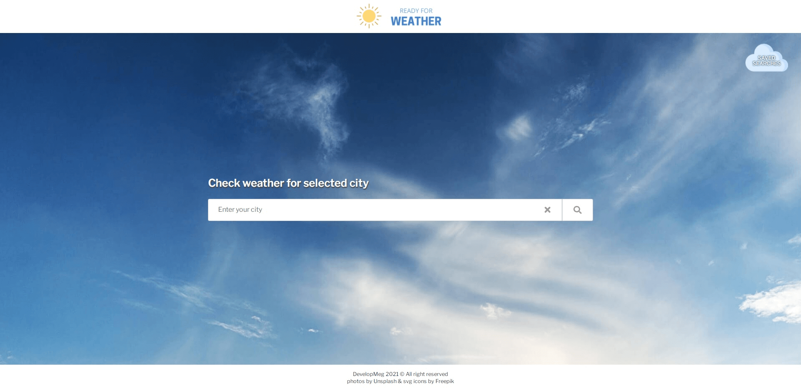
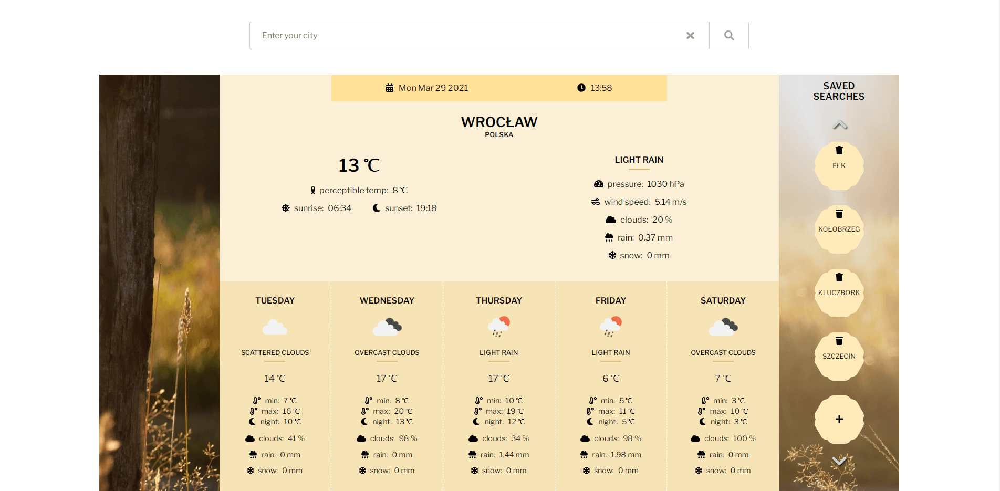
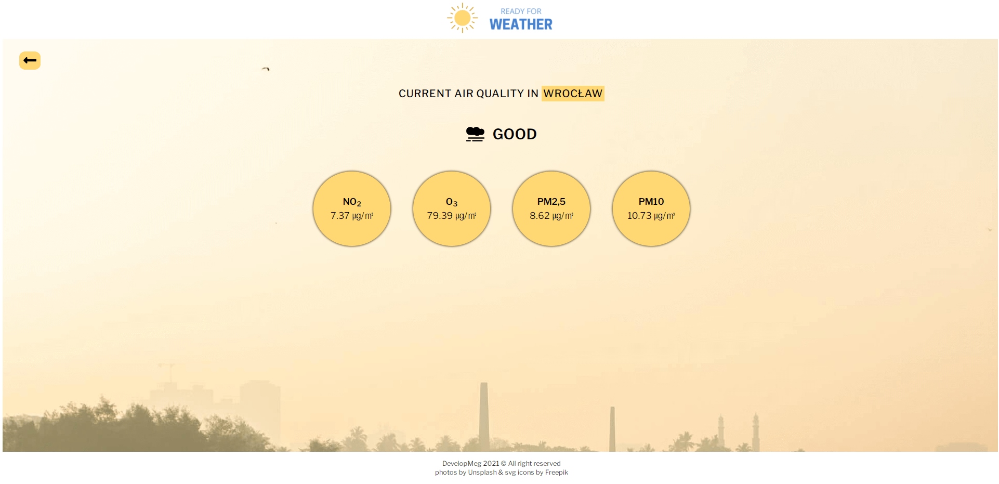

# ready-for-weather

> This is my the newest and the best project, which contain all aspects I learned from feedback, which received after complete the recruitment task.

#### This is an application, which let check weather

Link: https://developmeg.github.io/ready-for-weather/

---

## Technologies

- React (Create React App)
- React Router
- React Hooks
- React Context
- Styled Components
- Local Storage

#### Extra Packages

- Font Awesome (packages @fortawesome)
- diacritic
- nanoid
- react-confirm-alert

#### Data (APIs)

- OpenWeatherMap (One Call API, Air Pollution API) - [LINK](https://openweathermap.org/api)
- LocationIQ - [LINK](https://locationiq.com/)

## Installation

Clone this repository and install dependencies: `npm install`

Next run application on your localhost: `npm start`

To build project : `npm run build`
